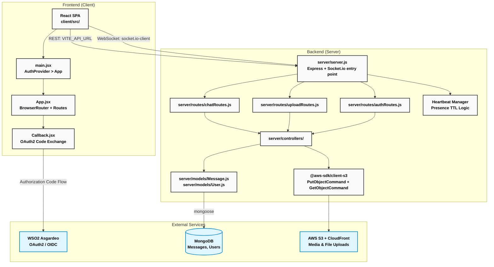
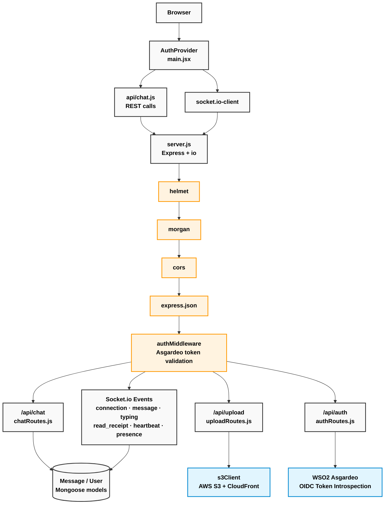

<div align="center">

# 💬 PulseChat

A production-grade real-time chat application featuring WebSocket-based messaging, live presence indicators, typing detection, read receipts, and secure file sharing — with social login via WSO2 Asgardeo OAuth2.


</div>

---

## 📑 Table of Contents

- [Overview](#overview)
- [Project Objectives](#project-objectives)
- [Architecture](#architecture)
  - [System Design](#system-design)
  - [Component Architecture](#component-architecture)
- [Technology Stack](#technology-stack)
- [Features](#features)
- [Getting Started](#getting-started)
- [API Documentation](#api-documentation)
- [Deployment](#deployment)
- [Project Structure](#project-structure)
- [Key Design Decisions](#key-design-decisions)
- [Contributing](#contributing)
- [License](#license)

---

## <a id="overview"></a>🔍 Overview

PulseChat is a full-stack real-time chat application built to demonstrate production-grade WebSocket architecture, cloud file storage, and OAuth2-based authentication in a modern MERN environment. The project implements a live messaging system with presence awareness, heartbeat-driven online detection, AWS S3 + CloudFront media delivery, and social login through WSO2 Asgardeo — with independent frontend/backend deployments.

---

## <a id="project-objectives"></a>🎯 Project Objectives

- Implement real-time bidirectional communication using Socket.io with resilient connection handling.
- Build a production-quality presence system using a heartbeat mechanism beyond basic connect/disconnect events.
- Demonstrate secure social authentication using WSO2 Asgardeo OAuth2 with server-side token validation.
- Establish scalable file delivery using AWS S3 presigned URLs and CloudFront CDN.
- Design a flexible MongoDB schema optimised for real-time chat data patterns.
- Apply clean React component architecture with protected routing and auth context.

---

## <a id="architecture"></a>🏗️ Architecture

### System Design

**Deployable Units and Their Code Roots:**


### Component Architecture

The application follows a layered architecture separating real-time and REST concerns:

- **Presentation Layer (Client):** React components, React Router v6, Auth context, and ProtectedRoute guards.
- **WebSocket Layer (Server):** Socket.io event handlers managing rooms, presence, typing state, and read receipts.
- **API Routing Layer (Server):** Express routers mapping REST endpoints to controllers for messages, uploads, and auth.
- **Controller Layer (Server):** Business logic for message persistence, file upload orchestration, and token validation.
- **Data Access Layer (Server):** Mongoose models for MongoDB message and user documents.
- **Infrastructure Layer:** AWS S3 + CloudFront for media, WSO2 Asgardeo for identity, Render for server hosting.

**Request Path — REST and WebSocket:**


---

## <a id="technology-stack"></a>💻 Technology Stack

### Frontend Core (`client/src/`)
| Category | Technology | Version |
|---|---|---|
| **UI Framework** | React + React DOM | `^19.x` |
| **Build Tool** | Vite + `@vitejs/plugin-react` | `^6.x` |
| **Routing** | React Router DOM | `^6.x` |
| **Styling** | Tailwind CSS | `^3.x` |
| **WebSocket Client** | socket.io-client | `^4.x` |
| **HTTP Client** | Axios | `^1.x` |
| **Authentication** | `@asgardeo/auth-react` | `^2.x` |

### Backend Core (`server/`)
| Category | Technology | Version |
|---|---|---|
| **HTTP Framework** | Express | `^4.x` |
| **WebSocket Server** | Socket.io | `^4.x` |
| **Database ODM** | Mongoose | `^8.x` |
| **File Uploads** | Multer | `^1.x` |
| **Cloud Storage** | `@aws-sdk/client-s3` | `^3.x` |
| **Security** | Helmet | `^7.x` |
| **Logging** | Morgan | `^1.x` |
| **CORS** | cors | `^2.x` |

### Identity & Infrastructure
| Category | Technology |
|---|---|
| **Identity Provider** | WSO2 Asgardeo (OAuth2 / OIDC) |
| **Auth Flow** | Authorization Code Flow with PKCE |
| **Social Providers** | Google, GitHub (via Asgardeo connections) |
| **Token Validation** | Asgardeo OIDC token introspection endpoint |
| **CDN** | AWS CloudFront (S3 origin) |

---

## <a id="features"></a>✨ Features

### Real-Time Communication
- **WebSocket Messaging:** Bidirectional real-time message delivery via Socket.io with room-based channel isolation.
- **Typing Indicators:** Live "is typing..." state broadcast to room participants with automatic timeout cleanup.
- **Read Receipts:** Message delivery acknowledgement tracked per user and persisted to MongoDB.
- **Online Presence System:** Heartbeat-based detection — clients ping on a timer, server marks users offline only after a missed window, preventing false offline flashes on unstable connections.

### Authentication & Security — WSO2 Asgardeo

PulseChat uses **WSO2 Asgardeo** as its managed identity provider, handling the full OAuth2/OIDC lifecycle so zero custom auth logic lives in the application.

- **Authorization Code Flow with PKCE:** Initiated client-side via `@asgardeo/auth-react`. On login, the user is redirected to the Asgardeo-hosted login page and returned to the app via a custom `Callback.jsx` handler that completes the code exchange.
- **Social Login:** Google and GitHub are configured as federated identity connections inside Asgardeo — no provider-specific SDK or credential is needed in the application layer.
- **Server-Side Token Validation:** Every REST request and Socket.io handshake passes the bearer token through `authMiddleware`, which validates it against Asgardeo's OIDC introspection endpoint before any data is touched.
- **Protected Routes:** A `ProtectedRoute` component wraps all authenticated views, checking Asgardeo session state and redirecting unauthenticated users before any API calls are made.
- **Security Headers:** `helmet` enforces HTTP security headers across all Express responses independently of auth state.


### File Sharing
- **AWS S3 + CloudFront:** Files uploaded via presigned URLs with CloudFront CDN delivery — fast, private, and decoupled from the application server.
- **Multer Integration:** Multipart file handling on the Express layer before S3 upload orchestration.

### DevOps
- **CI/CD Pipeline:** Automated deployments on merge to `main` via Render (backend) and Vercel (frontend).
- **Environment Secret Management:** Strict `.env` separation across client and server, no credential leakage.

---

## <a id="getting-started"></a>🚀 Getting Started

### Prerequisites
- Node.js v18 or higher
- MongoDB connection (local or MongoDB Atlas)
- WSO2 Asgardeo organization + application (free tier at [asgardeo.io](https://asgardeo.io))
- AWS S3 bucket + CloudFront distribution

### Local Development Setup

Clone and configure the repository:
```bash
git clone https://github.com/Akil-Dikshan/pulsechat.git
cd pulsechat
```

**1. Configure the Backend**
```bash
cd server
npm install
```

Create a `.env` file in the `server` directory:
```env
PORT=5000
MONGODB_URI=your_mongodb_connection_string
ASGARDEO_CLIENT_ID=your_asgardeo_client_id
ASGARDEO_CLIENT_SECRET=your_asgardeo_client_secret
ASGARDEO_BASE_URL=https://api.asgardeo.io/t/your_org
AWS_ACCESS_KEY_ID=your_aws_key
AWS_SECRET_ACCESS_KEY=your_aws_secret
AWS_REGION=your_region
AWS_BUCKET_NAME=your_bucket_name
CLOUDFRONT_URL=your_cloudfront_distribution_url
```

**2. Configure the Frontend**
```bash
cd ../client
npm install
```

Create a `.env` file in the `client` directory:
```env
VITE_API_URL=http://localhost:5000
VITE_ASGARDEO_CLIENT_ID=your_asgardeo_client_id
VITE_ASGARDEO_BASE_URL=https://api.asgardeo.io/t/your_org
VITE_ASGARDEO_REDIRECT_URL=http://localhost:5173/callback
```

### Build and Run

Open two terminal instances.

**Terminal 1 (Backend):**
```bash
cd server
npm run dev
```

**Terminal 2 (Frontend):**
```bash
cd client
npm run dev
```

Visit `http://localhost:5173` to verify startup.

---

## <a id="api-documentation"></a>🔌 API Documentation

### Authentication Flow
All protected REST endpoints require `Authorization: Bearer <token>` in the request header. The token is obtained after completing the Asgardeo OAuth2 Authorization Code flow via `Callback.jsx`.

### Chat Endpoints

**Get Message History**
```http
GET /api/chat/:roomId
Authorization: Bearer {token}
```

**Send Message (REST fallback)**
```http
POST /api/chat
Authorization: Bearer {token}
Content-Type: application/json

{
  "roomId": "room_123",
  "content": "Hello!",
  "type": "text"
}
```

### Upload Endpoint

**Upload File**
```http
POST /api/upload
Authorization: Bearer {token}
Content-Type: multipart/form-data

[file attached]
```
Returns a CloudFront-signed URL for the uploaded file.

### Socket.io Events

| Event | Direction | Description |
|---|---|---|
| `message` | Client → Server | Send a new chat message |
| `message` | Server → Client | Broadcast message to room |
| `typing_start` | Client → Server | User started typing |
| `typing_stop` | Client → Server | User stopped typing |
| `typing` | Server → Client | Broadcast typing state to room |
| `read_receipt` | Client → Server | Acknowledge message read |
| `heartbeat` | Client → Server | Presence ping |
| `presence` | Server → Client | Online/offline status update |

---

## <a id="deployment"></a>🌐 Deployment

### Infrastructure
- **Frontend:** Hosted on **Vercel** for global CDN delivery and instant preview deployments.
- **Backend:** Hosted on **Render** (Node.js web service) with GitHub integration and auto-deploy on push.
- **Database:** **MongoDB Atlas** for managed, scalable document storage.
- **Storage:** **AWS S3 + CloudFront** for persistent, CDN-accelerated file delivery independent of server restarts.
- **Identity:** **WSO2 Asgardeo** as the managed OAuth2/OIDC identity provider.

### CI/CD Pipeline
Deployments are triggered automatically on merge to `main`:
1. **Vercel** detects frontend changes, builds the React app, and distributes globally.
2. **Render** detects backend changes, installs dependencies, and restarts the Express + Socket.io service.

---

## <a id="project-structure"></a>📂 Project Structure

```text
pulsechat/
├── client/                      # React Frontend
│   ├── src/
│   │   ├── api/                 # Axios HTTP client wrappers
│   │   ├── components/          # Reusable UI components (ChatWindow, MessageBubble, etc.)
│   │   ├── context/             # Auth context and socket context
│   │   ├── pages/               # React Router route views
│   │   ├── hooks/               # Custom hooks (useSocket, usePresence)
│   │   ├── App.jsx              # Main routing map
│   │   └── main.jsx             # React DOM entry / Provider wrapping
│   ├── index.html
│   ├── vite.config.js
│   └── package.json
├── server/                      # Node/Express API + Socket.io
│   ├── config/                  # DB and general configurations
│   ├── controllers/             # Business logic (chat, upload, auth)
│   ├── middleware/              # Auth validation, error handlers
│   ├── models/                  # Mongoose schemas (Message, User)
│   ├── routes/                  # Express route definitions
│   ├── socket/                  # Socket.io event handlers and presence logic
│   ├── utils/                   # AWS S3 helpers, heartbeat manager
│   ├── server.js                # Express + Socket.io entry point
│   └── package.json
└── .github/                     # GitHub Actions workflows
```

---

## <a id="key-design-decisions"></a>🔑 Key Design Decisions

| Decision | Detail |
| :--- | :--- |
| **Heartbeat Presence** | Standard connect/disconnect events fire too aggressively on unstable connections. A client-side ping with a server-side TTL window prevents false offline flashes and gives a smoother experience. |
| **Presigned S3 URLs** | Files are uploaded directly to S3 with short-lived presigned URLs, keeping binary data off the application server entirely and avoiding memory pressure on Render's free tier. |
| **WSO2 Asgardeo over Custom Auth** | Delegating identity to Asgardeo eliminates custom session storage, JWT rotation logic, refresh token handling, and 2FA implementation entirely. The `@asgardeo/auth-react` SDK manages the full PKCE flow client-side; the server only needs to introspect the token. Google and GitHub social login are configured as Asgardeo federated connections — no extra provider SDK needed in the app. |
| **MongoDB for Chat Data** | Document-oriented storage suits chat message shapes naturally — flexible attachment schemas, read receipt arrays, and typing metadata fit better as embedded documents than relational rows. |
| **Socket.io over Raw WebSocket** | Socket.io adds automatic reconnection, room management, and fallback transports, which matter significantly for presence reliability on varying network conditions. |

---

## <a id="contributing"></a>🤝 Contributing

**Development Workflow:**
1. Fork the repository
2. Create your feature branch: `git checkout -b feature/AmazingFeature`
3. Commit your changes: `git commit -m 'Add some AmazingFeature'`
4. Push to the branch: `git push origin feature/AmazingFeature`
5. Open a Pull Request

---

## <a id="license"></a>⚖️ License

This project is licensed under the ISC License.

<div align="center">
  <br/>
  <p>⬆ <a href="#-pulsechat">Back to Top</a></p>
  <p>Made with ❤️ by <strong>Akil Dikshan</strong></p>
</div>
